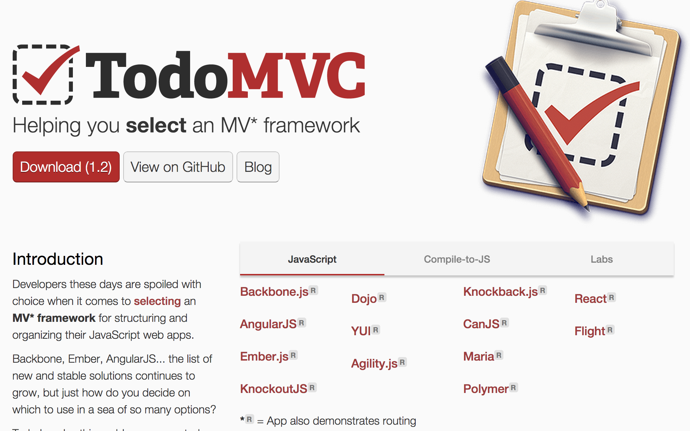

name: inverse
class: center, middle, inverse
layout: true

---
class: titlepage, no-number
# AngularJS
## .author[부설연구소 통계분석파트 이도현<br>ZUM internet]

---
layout: false
# Agenda

- Javascript
- SPA(Single Page Application)
- AngularJS 소개
- AngularJS 기본 개념
- AngularJS 내부 기능 요약
- AngularJS 내부 동작과 성능

---
# Javascript

이 문제는 [Effective Javascript](http://www.yes24.com/24/goods/9375384?scode=032)에서 발췌

.x-small[
```javascript
3 + true = ?;	// 문법 에러 아닌가?..
```]

.x-small[
```javascript
function swap(a, i, j) {
	temp = a[i];	// 이게 동작은 하는데 나중에 문제가 될 수도...
	a[i] = a[j];
	a[j] = temp;
}
```]

.x-small[
```javascript
function hoistingTest() {
	console.log("뭐가 나올까? : " + test);
	if (true) {
		var test = "짠!";
	}
	console.log("변수를 블록안에서 선언했는데.... : " + test);
 }
 hoistingTest();
```]

---
# Javascript

앞의 질문에 대한 정답!

- 암묵적인 형변환
- var의 유무에 따라 변수 스코프가 달라짐 (전역? 지역?)
- 자바스크립트는 블록 단위 스코프를 지원하지 않고, 변수 선언과 할당이 나눠짐 (Variable Hoisting) -> 아래와 같아짐

.x-small[
```javascript
function hoistingTest() {
	var test;
	console.log("선언만 했군.. : " + test);
	if (true) {
		test = "짠!";
	}
	console.log("할당도 됐어.. : " + test);
 }
 hoistingTest();
```]

---
# Javascript

장점도 많지만 생각보다 잘못 사용 될 여지가 많은 언어

- 너무 유연함
- 암묵적인 형변환
- 전역변수
- 모듈 시스템을 제공하지 않음

개발자의 이해도와 숙련도에 따라 결과물 차이가 클 것 같다

---
# Javascript

장점도 이야기 해줘야지...

- 그런데 왜 쓰냐고 묻는다면 '풍부한 접근성'과 '보편성'
- 유연함이 큰 무기가 될 수 있음
- 다양한 요구사항을 충족시켜주는 프레임워크가 많이 만들어지고 있다.
- CoffeeScript를 쓰면 많은 단점을 보완할 수 있다고 하던데..

---
# Javascript

올바르게 잘 쓰는 방법은?

- strict mode (문제가 될만한 걸 사전에 알려줌)
- 모듈 시스템 (독립적인 실행 영역, Lazy-Loading)
- 프로토타입 (Inheritance)
- 함수형 (Immutable, No side effect)
- 비동기 (Ajax, Callback, Promise)

---
# Single Page Application

A single-page application (SPA), also known as single-page interface (SPI), is a web application or web site that fits on a single web page with the goal of providing a more fluid user experience akin to a desktop application. - from wikipedia
- HTML, JavaScript, CSS를 이용해서 개발
- Gmail, Google Drive (이 분야 조차도 구글이 1등인 것 같네요.. 아닌가..)
- zum.com (프론트 줌도 SPA라고 볼 수 있어요)
- SPA를 프레임워크 도움이 없이 만드는 건 너무 힘들다...
##### Backbone.js, AngularJS, Ember.js, KnockoutJS, Dojo, YUI, Agility.js, Knockback.js, CanJS, Maria, Polymer, React, Flight, Batman, Meteor, Derby, SocketStream, ExtJS, Kendo UI (계속 뭔가 만들어지고 있음ㅠ)

---
# Single Page Application

.img-90[  ]

http://todomvc.com

---
# Single Page Application


---
# AngularJS 소개

- 2009년 Misko Hevery(Googler)의 개인 프로젝트로 시작
- 2012년 6월 Release 1.0 (Latest Release 1.2.23)
- 현재는 AngularJS 풀타임 개발팀이 만들어져 있음
- 1.2x는 IE8까지 지원하지만, 1.3 이후부터는 IE8 지원하지 않음
- Google Product에도 사용 중
	- Youtube on PS3
	- DoubleClick by Google
- [AngularJS GitHub](https://github.com/angular/angular.js)

---
# AngularJS 소개

Hello World!

.x-small[
```html
<!DOCTYPE html>
<html ng-app>
  <head>
    <meta charset="utf-8" />
    <title>AngularJS Hello World!</title>
    <script src="https://code.angularjs.org/1.2.23/angular.js"></script>
  </head>
  <body>
	<p>Hello {{name}}!</p>
	<input type="text" ng-model="name">
  </body>
</html>
```]

http://plnkr.co/edit/V1WINBiSKTfpU0sedLWC?p=preview

이 기능을 jQuery로 구현 한다면?<br>
Selector로 DOM 탐색해서 접근 할 수 있게 하고<br>
input태그에 이벤트 바인딩해서 감시하고 변할때마다 p태그에 넣어주고...<br>
AngularJS는 스크립트 코딩이 필요하지 않음

---
# AngularJS 소개

좀 더 많은 예제는 AngularJS 공식 홈페이지에서...

https://angularjs.org

---
# AngularJS 기본 개념

HTML enhanced for web apps!

- 브라우저에게 새로운 트릭을 가르친다
- 선언형 템플릿 뷰와 명령형 컨트롤러 로직
- 양방향 데이터 바인딩
- 모듈과 의존성 주입

---
# AngularJS 기본 개념

Directives, Scope, Model, View, Controller


---
# AngularJS 기본 개념

브라우저에게 새로운 트릭을 가르친다 - Directive

- HTML을 템플릿 언어로 사용
- 로직과 UI 사이를 이어주는 접착제 같은 역할
- 마크업에 새로운 의미와 새로운 동작을 추가하기 때문에 DOM 조작이 일어남
	- 내부적으로 jqLite라고 하는 jQuery 간소화 버전을 내장하고 있어서 jQuery가 필요하지 않음
	- jQuery를 로드하면 jqLite는 jQuery로 구현체가 바뀜
- 사용자 정의 Directive 구현도 가능
- [AngularJS Directive](https://github.com/angular/angular.js/tree/master/src/ng/directive)

---
# AngularJS 기본 개념

선언형 템플릿 뷰와 명령형 컨트롤러 로직 - View, Controller

- AngularJS는 선언적인 방식으로 UI를 구성
	- 자바스크립트 코드에서는 DOM 요소에 대한 어떤 참조와 조작이 필요하지 않음
	- 모델의 변화와 로직에만 집중하면 된다
- SQL처럼 생각하기
	- 쿼리를 작성하면 어떻게 데이터를 찾아야 하는지에 대해선 몰라도 됨
- AngularJS에선 Directive를 제외하곤 DOM 조작을 할 일이 없다.

---
# AngularJS 기본 개념

양방향 데이터 바인딩 - Scope, Model

- Scope
	- 컨트롤러나 디렉티브의 유효범위내의 저장공간(데이터, 로직)
	- App엔 하나의 root scope가 있고, 여러개의 하위 scope가 있음
	- 모델 변경을 감지하고 표현하기 위한 책임을 갖는다
	- Javascript Prototype 상속 구조를 가짐
	- Isolate Scope도 지원 (부모와 연결을 차단)
- Model은 평범한 자바스크립트 객체
	- 모델이 프레임워크에 의존적이지 않다 (intrusive)

---
# AngularJS 기본 개념

모듈과 의존성 주입 - Module, DI, Services

- Module은 AngularJS가 관리하는 객체의 컨테이너 역할
	- 코드 구조, 객체 등록, 의존 관계 선언
- Service는 컨트롤러에서 뷰와 독립적인 로직을 분리하고 주입 받음
	- 서비스 객체를 어떻게 생성할지 정의 해줘야 함
		- value, service, factory, constant, provider
	- Singleton
	- AngularJS built-in services ('$'로 시작. e.g. $http)
- DI 덕분에 강력한 테스팅 기법을 도입
	- Jasmine, Karma

---
# AngularJS 내부 기능 요약

- 서버와 통신
- 데이터 포맷과 출력, 필터
- 폼 데이터 조작 및 검증
- 네비게이션 구성
- 국제화 & 지역화

---
# AngularJS 내부 동작과 성능

- Event Loop
- $apply method call (모델 변경 감시 시작)
- $digest loop (모델 변경 감시 과정)
- CPU 사용률 최적화
- 메모리 소비 최적화
- ng-repeat

---
# AngularJS 내부 동작과 성능

Event Loop

.img-80[  ]

---
# AngularJS 내부 동작과 성능

$apply method call (모델 변경 감시 시작)

- Polling을 하나?? 이건 아님
- 모델이 변경 될 만한 상황만 감시
	- DOM 이벤트
	- XHR 응답으로 인한 콜백
	- 브라우저의 주소 변경
	- 타이머로 인한 콜백
- $apply 메소드가 호출되면서 감시가 시작되고, 보통 디렉티브에서 호출됨

---
# AngularJS 내부 동작과 성능

$digest loop (모델 변경 감시 과정)

- 근데 왜 $digest loop가 필요한가?
	- 웹브라우저는 싱글 UI 스레드를 가지기 때문에 컨텍스트 스위칭이 최대한 적은 게 유리함
	- DOM을 변경하는 작업은 매우 비싼 작업임
- 결국, 모델이 안정화되는 가장 마지막 시점에 딱 한 번만 바꾸는 게 좋다!!
- 모델 값의 변경 여부는 Dirty-Checking 메커니즘을 이용
	- $watch list에 하나라도 watch가 남아있다면 dirty 상태
	- $rootScope부터 시작해서 DFS로 모든 스코프를 순회하여 watch를 평가하고 무한 루프 방지를 위해서 10번까지만 수행
	- 10번이 넘어도 페이지 렌더링은 되지만, 뭔가 문제가 있는 상황이므로 확인해야함

---
# AngularJS 내부 동작과 성능

CPU 사용률 최적화

- $digest 루프를 빠르게 (일반적으로 50ms 이내)
	- watch를 가볍고 빠르게 만들기 (필터 로직이 무겁진 않은지)
	- watch 표현식에서 DOM 접근하지 말것
	- 필요 없거나, 눈에 보이지 않거나, 사용 되지 않는 watch 제거
- $digest 루프 빈도 줄이기 -> 모델이 변경 될 만한 상황을 줄이자
- $digest 루프의 수 제한
	- 모델이 불안정하면 루프를 많이 실행
	- 뭔가 이상하다고 느끼고 빨리 해결하자

---
# AngularJS 내부 동작과 성능

메모리 소비 최적화

- 가능하면 deep-watching 피하기
	- 기본적으론 값만 비교하거나, 값 + 타입 비교
	- 모델 객체가 수많은 프로퍼티를 가지고 있는데 전체 비교를 하는 건 많이 느리고, 거기다 복사 및 저장됨
- watch의 대상이 되는 표현식의 크기 고려
	- 아래 긴 문자열은 variable 부분만 watch를 만들지 않고 p 태그 전체에 대해서 만들게 되어 메모리를 많이 차

.x-small[
```html
<p>엄청 길다... {{variable}} 또 길다...</p>
<p>이건 괜찮음... <span ng-bind="variable"></span> 이건 괜찮음...</p>
```]

---
# AngularJS 내부 동작과 성능

ng-repeat

- AngularJS에서 가장 유용한 디렉티브지만.... 성능에 민감
- $digest 루프를 돌 때마다 컬렉션을 적지 않게 조사해야 하고, 변경을 감지하면 영향 받는 DOM 재구성도 필요
- watch 바인딩 기준으로 수천개 수준은 알맞지 않다
- 필터링이나 페이징, 사용자 정의 디렉티브를 만들어서 사용

---
# 유용한 툴 소개

- Batarang - 크롬 확장프로그램으로 모델 정보와 성능 측정을 도와줌
- [Plunker](http://plnkr.co/) - Online Editor, AngularJS로 구현됨
- http://ngmodules.org/ - 자신이 만든 모듈을 공유하는 사이트

---
# 참고서적 및 웹페이지

- http://www.yes24.com/24/goods/13527426?scode=032
- http://www.yes24.com/24/goods/9375384?scode=032
- https://docs.angularjs.org/guide
- http://helloworld.naver.com/helloworld/639204
- http://soomong.net/blog/2014/01/20/translation-ultimate-guide-to-learning-angularjs-in-one-day/
- http://www.nextree.co.kr/tag/angularjs/

---
# Midas Web

Midas Web UI도 AngularJS로 구현되어 있습니다.

.img-90[  ]

---
name: last-page
class: center, middle, no-number
## Thank You!
### http://leedohyun.github.io/angularjs-seminar

.footnote[Slideshow created using [remark](http://github.com/gnab/remark).]
